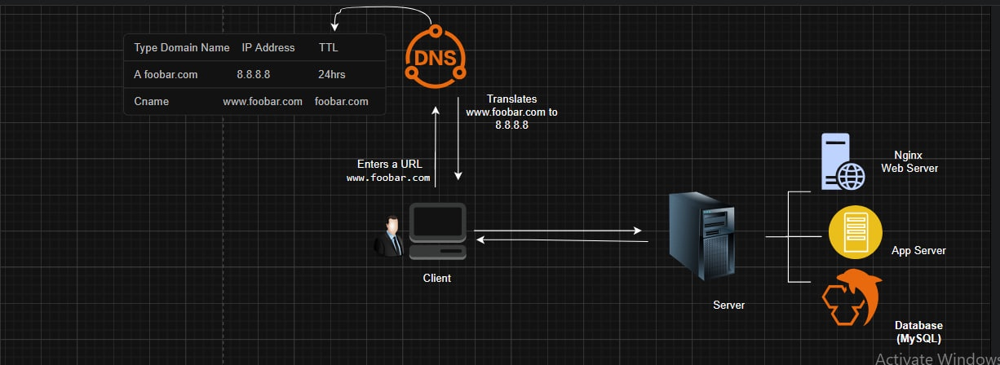

# 0. Simple Web Stack

## Diagram

---

## Overview
This project explains the design of a **one-server web infrastructure** that powers a simple website — **www.foobar.com**.  
The setup is built on a LAMP-like stack (Linux, Nginx, MySQL, and a backend language) and demonstrates how a single machine can host both static and dynamic web content.

We will start with the **user’s perspective** and then break down each component.

---

## How it works — From User to Website
1. A user opens a browser and types **www.foobar.com**.
2. The browser contacts the **Domain Name System (DNS)** to find the IP address for `www.foobar.com`.
3. DNS returns the IP **8.8.8.8**, which points to our server.
4. The browser sends an **HTTP** or **HTTPS** request to that server.
5. The **web server** (Nginx) processes the request:
   - If it’s a static file (HTML, CSS, image), Nginx sends it directly.
   - If it’s dynamic content, Nginx forwards the request to the **application server**.
6. The **application server** runs the backend code, which may query the **MySQL database** for data.
7. The processed result is sent back through Nginx to the user’s browser.

---

## Components and Roles

### 1. Server
A physical or virtual machine that stores files, runs services, and processes web requests.  
In this setup, **one Ubuntu server** hosts all services.

### 2. Domain Name
A human-friendly address (`www.foobar.com`) that maps to the server’s IP.  
It saves users from remembering numerical IPs.

### 3. DNS Record
The `www` in `www.foobar.com` is configured as an **A record**, pointing to the IP `8.8.8.8`.  
This record tells the internet where to find our server.

### 4. Web Server — Nginx
- Handles incoming HTTP/HTTPS requests.
- Serves static files directly.
- Passes dynamic requests to the application server.

### 5. Application Server
- Runs the backend logic (e.g., Python, PHP, Node.js).
- Processes user requests and interacts with the database when needed.

### 6. Application Files (Code Base)
- Contains the website’s source code.
- Includes HTML, CSS, JavaScript, and backend logic.

### 7. Database — MySQL
- Stores persistent data (e.g., user accounts, posts, transactions).
- Responds to read/write requests from the application server.

### 8. Communication
- The server communicates with the user’s computer via **HTTP** or **HTTPS** over the internet.

---

## Known Issues with This Setup

1. **Single Point of Failure (SPOF)**  
   If the server fails, the entire website becomes unavailable.

2. **Downtime During Maintenance**  
   Updating the application or restarting services makes the site temporarily inaccessible.

3. **Scalability Limits**  
   One server can only handle a limited number of simultaneous users.

---

## Acronyms to Know
- **SPOF** — Single Point of Failure  
- **DNS** — Domain Name System  
- **HTTP/HTTPS** — HyperText Transfer Protocol (Secure)  

---

## Author
Part of the **ALX System Engineering & DevOps** curriculum.  
[Diagram Source](https://i.imgur.com/SVA1Qgn.jpeg)
