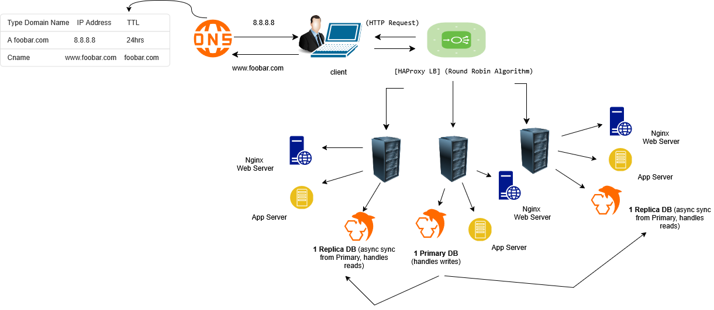

# 1. Distributed web infrastructure

## Diagram

## Overview
This design provides a simple distributed web infrastructure for **www.foobar.com** using three servers:
- **Server: Load Balancer** — HAProxy
- **Server A** — Nginx (web server) + Application server + Code base + MySQL (Primary / Master)
- **Server B** — Nginx (web server) + Application server + Code base + MySQL (Replica)

Traffic to `www.foobar.com` resolves to the load balancer, which distributes incoming requests to Server A and Server B.

## Why each component is added
- **Load Balancer (HAProxy)**: Distributes incoming HTTP/HTTPS requests across Server A and Server B, preventing overload and providing redundancy.
- **Web Server (Nginx)**: Serves static files and forwards dynamic requests to the app server.
- **Application Server**: Runs the business logic of the site.
- **Code Base**: Deployed on both servers so either can handle requests.
- **Database (MySQL)**: Primary-Replica replication for data redundancy.

## Load balancer distribution algorithm
**Round robin** — forwards each new request to the next server in rotation for even load.

## Active-Active vs Active-Passive
- **Active-Active (chosen)**: Both servers process traffic simultaneously.
- **Active-Passive**: Only one server handles traffic; the other is on standby.

## MySQL Primary-Replica replication
- **Primary**: Accepts reads & writes.
- **Replica**: Read-only, synced from Primary.
- Keeps data consistent across nodes.

## Known issues
- **SPOF**: Single load balancer and single Primary DB.
- **Security**: No firewall, no HTTPS.
- **No monitoring**: No alerts or metrics in place.
