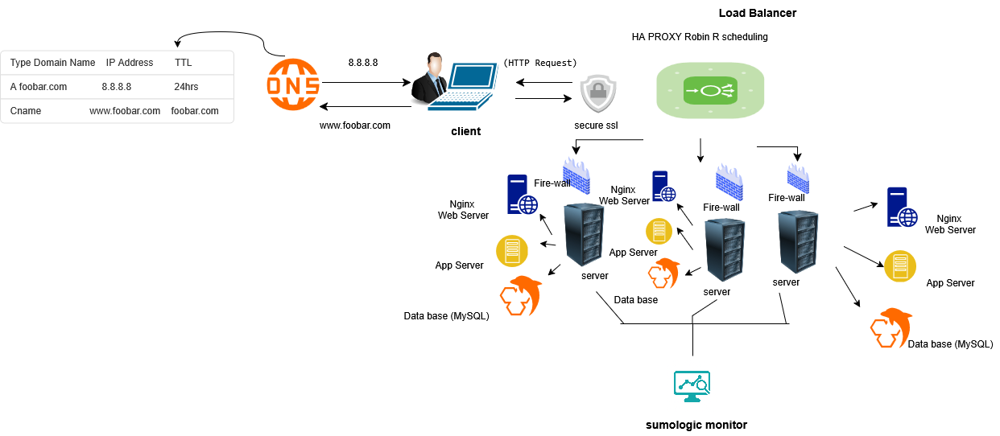

# 2. Secured and monitored web infrastructure

## Diagram

## Overview
This infrastructure hosts **www.foobar.com** using three servers, each protected by its own firewall. It serves encrypted HTTPS traffic using an SSL certificate and has monitoring clients installed to collect data for Sumologic (or other monitoring tools).

---

## Components and Purpose

### Firewalls (3 total)
- **Purpose:** Filter incoming and outgoing network traffic, only allowing trusted traffic through.
- **Reason for adding:** Prevent unauthorized access, block malicious packets, and protect services from exposure.

### SSL Certificate (1 total)
- **Purpose:** Encrypts traffic between client browsers and the web infrastructure.
- **Reason for adding:** Prevents data from being intercepted or altered during transmission.

### Monitoring Clients (3 total)
- **Purpose:** Collect logs and metrics from each server and send them to a central monitoring system (e.g., Sumologic).
- **Reason for adding:** Helps detect downtime, performance issues, and abnormal spikes in traffic.

---

## Monitoring Details
- **How data is collected:** Agents installed on each server read logs, measure performance metrics, and forward them to the monitoring backend.
- **QPS monitoring:** Configure the monitoring tool to parse web server access logs and count the number of queries/requests per second. Trigger an alert if QPS exceeds safe operational thresholds.

---

## Issues with this infrastructure
1. **SSL Termination at Load Balancer**
   - Problem: Traffic between the load balancer and backend servers is unencrypted.
   - Risk: Internal network sniffing could expose sensitive data.

2. **Single MySQL Write Server**
   - Problem: If the master server goes down, the application cannot write to the database.
   - Solution: Add replication and automated failover.

3. **All-in-One Servers**
   - Problem 1: Resource usage for DB, app, and web components doesn’t grow equally — scaling independently becomes difficult.
   - Problem 2: Maintenance or failure of one component affects all others on that server.

---

## Security and Monitoring Benefits
- **Firewalls:** First line of defense.
- **HTTPS:** Secure data transfer and protect user privacy.
- **Monitoring:** Detect and respond quickly to failures, slowdowns, or security breaches.

---

**Repository:** [alx-system_engineering-devops](https://github.com/Benareyo/alx-system_engineering-devops)  
**Directory:** `0x09-web_infrastructure_design`  
**File:** `2-secured_and_monitored_web_infrastructure.md`
