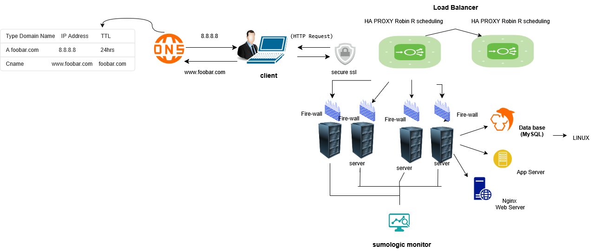

# 3. Scale Up - Web Infrastructure

## Diagram

## Overview
This task scales the previous web infrastructure for **www.foobar.com** by adding one server, clustering an additional HAProxy load balancer with the existing one, and splitting components so that the web server, application server, and database each have their own dedicated server.

## Changes made
- **Added 1 server** (so there are now independent servers for web, app, and DB).
- **Added 1 HAProxy load balancer** and configured it as a cluster with the previous load balancer (so there are 2 LBs for high availability).
- **Split components** so each major component is on its own server:
  - **Web Server**: Nginx — serves static assets and proxies dynamic requests.
  - **Application Server**: e.g., Gunicorn / Node — runs application logic.
  - **Database Server**: MySQL / PostgreSQL — persists data.

## Why each element was added
- **Extra server**: Improves capacity and redundancy; enables horizontal scaling and isolates failure domains.
- **Second HAProxy (clustered)**: Ensures a load balancer failure does not bring the service down. Configure as active-active or active-passive using health checks and VRRP/keepalived for VIP failover.
- **Dedicated Web Server**: Offloads static content and TLS termination (if desired) from the application server for better performance.
- **Dedicated Application Server**: Keeps business logic separate from static content handling so CPU/memory consumption for app processing is isolated.
- **Dedicated Database Server**: Keeps disk I/O and memory demands for DB operations away from web/app processes, improving stability and allowing DB-specific tuning.
  
## Application server vs Web server
- **Web server (Nginx / Apache)**: Optimized for serving static files, handling TLS, reverse-proxying, caching, and managing many concurrent connections.
- **Application server (Gunicorn / uWSGI / Node)**: Runs the application code, performs business logic, and handles dynamic content generation and DB interactions.

## Operational notes
- **Load balancing algorithm**: Round-robin (simple and fair) or use least-connections for uneven workloads.
- **High availability for LBs**: Use keepalived/VRRP to manage a floating VIP between the HAProxy instances.
- **Monitoring & alerts**: Ensure monitoring agents (Sumo Logic or similar) are installed on each server and that you have QPS, latency, error-rate, and resource-usage alerts.

## Files included
- `sketches/3-scale_up.png` — architecture diagram
- this README (`3-scale_up.md`)

